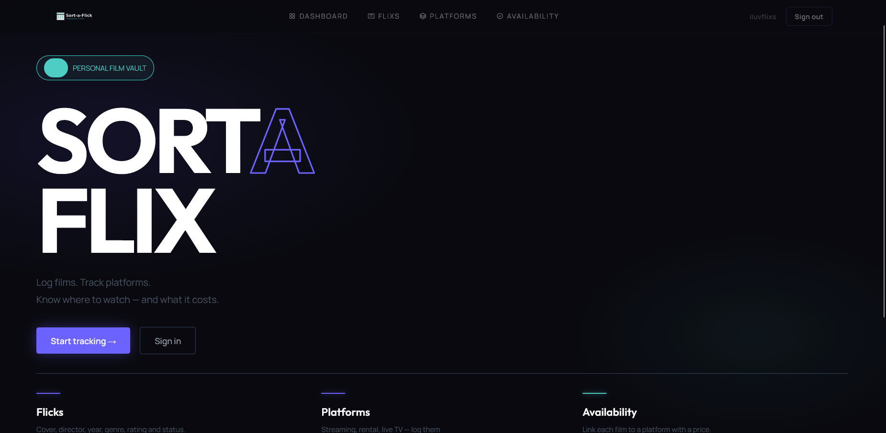
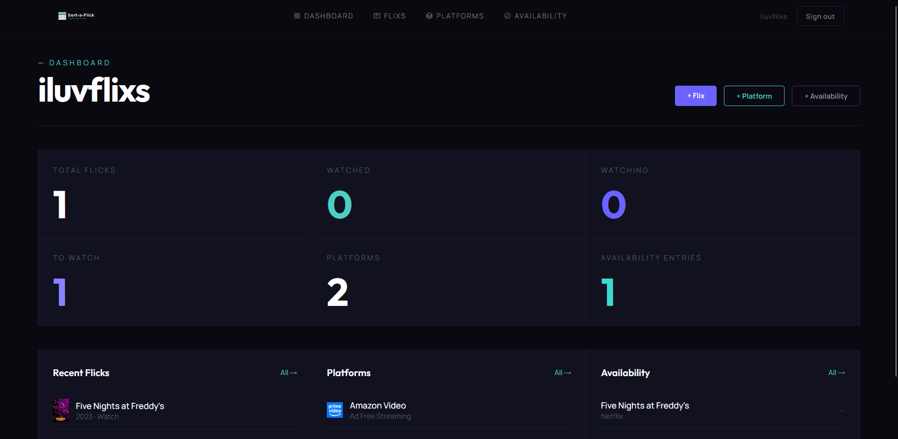
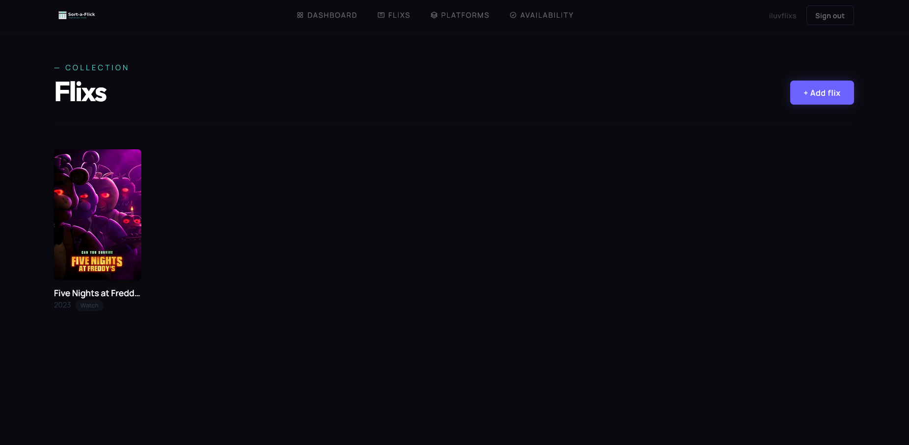
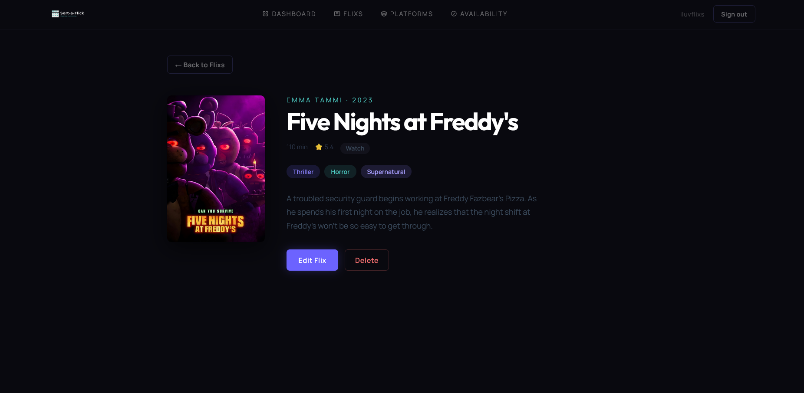
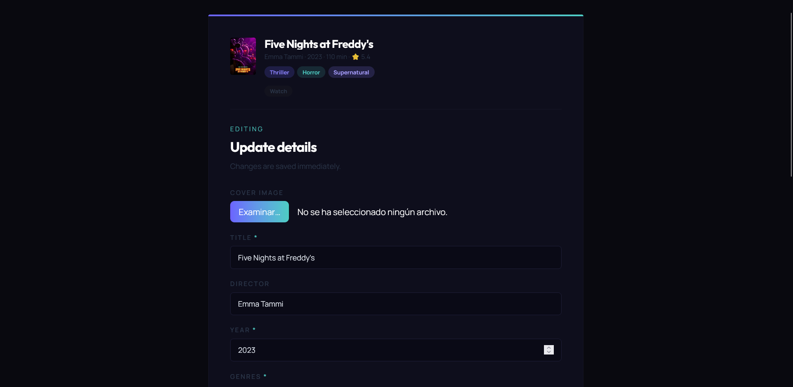
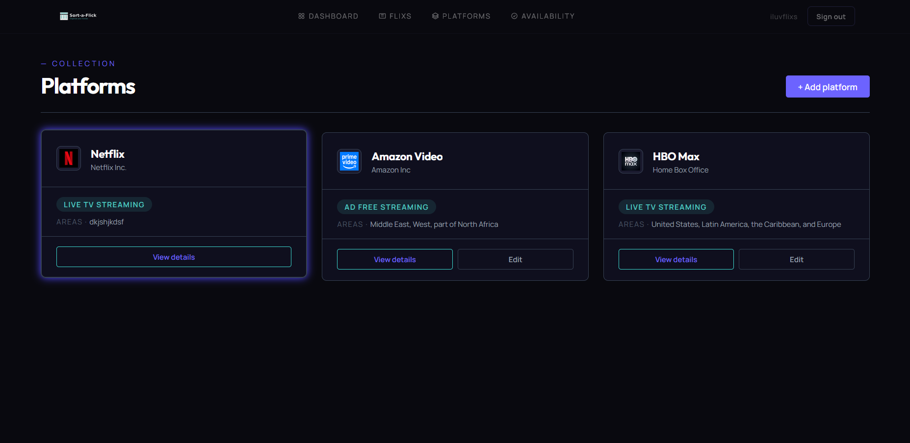
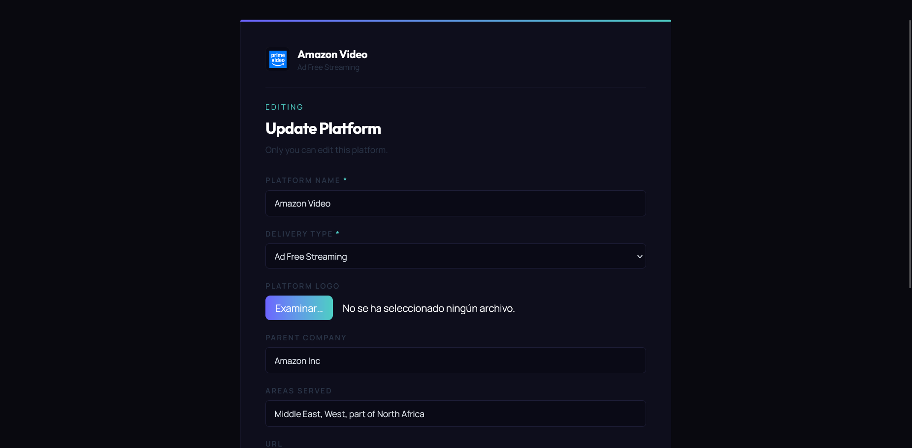
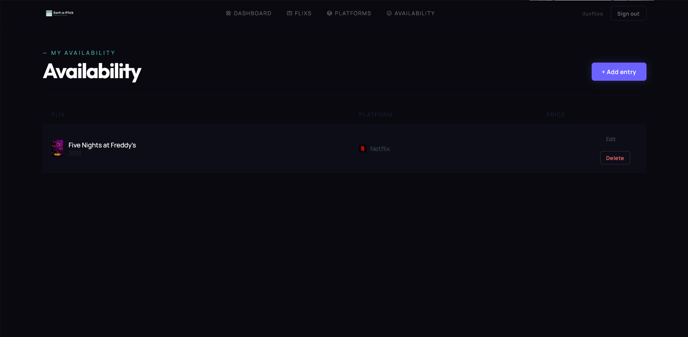
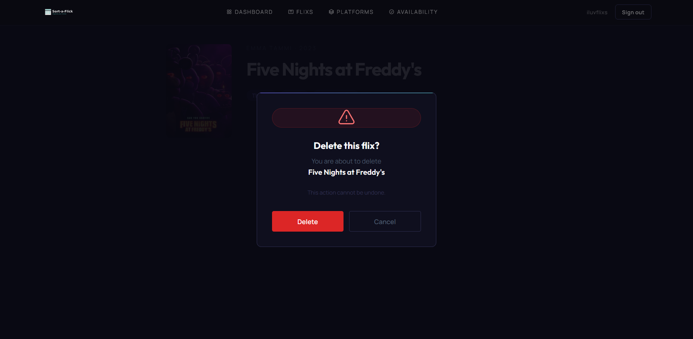

# SortaFlix — Your mini personal cinema 🎞️✨

SortaFlix is a small Django app to keep track of your movies, the platforms where you watch them, and prices when applicable. Great for organizing your collection and quickly knowing where to watch each title.

<p align="center">🇪🇸 <a href="README.md">README Spanish version</a></p>

## 🧩 Features

- 🎬 Add and organize movies: cover, title, director, year, genres, duration, rating and status (watched / watching / to watch).
- 📺 Register platforms: logo, delivery type (SVOD, Live, Rental), areas served and a description.
- 🔗 Link movies to platforms and note prices (Availability).
- 🔐 User accounts: sign up and sign in; each user manages their own records.

## ⚙️ Installation & setup

1. Create and activate a virtual environment

```powershell
python -m venv .venv
.\\.venv\\Scripts\\Activate.ps1
```

2. Install minimal dependencies

```powershell
pip install django==6.0.1 Pillow
```

3. Apply migrations (creates the database)

```powershell
python manage.py migrate
```

4. (Optional) Create a superuser

```powershell
python manage.py createsuperuser
```

5. (Optional and use with care) Seed the database with example data

```powershell
python manage.py seed
```

Note: the `seed` command deletes users and existing data — use only in test/dev environments.

6. Run the development server

```powershell
python manage.py runserver
```

Open http://127.0.0.1:8000/ in your browser.

> 🔔 IMPORTANT NOTE
>
> - The `media/` folder is ignored by Git: cover images and logos are not included. If you run `seed` some images may be missing. Options:
>   - Add example images in a versioned folder like `media/` and, within it, two subdirectories `covers/` and `platform_logos/`.
>   - Edit `seed.py` to use placeholders (URLs or text) instead of local files.
> - `db.sqlite3` is in `.gitignore`: run `python manage.py migrate` on a fresh clone.
> - `sort_a_flix/settings.py` contains a hard-coded SECRET_KEY and `DEBUG = True`. For production move the key to an environment variable and set `DEBUG = False`.

## 🔑 Test users

The `seed` command (saf_start/management/commands/seed.py) creates several example users. You can use these to sign in:

- Username: `iluvflixs` — Password: `1a2b3c`
- Username: `sharperdanaknife` — Password: `!tsaKnifee`
- Username: `whoiswolvie` — Password: `bubwudah3lly`

## 📸 Screenshots



Landing — Home screen



Dashboard — User summary



Flixs — Movies list



Movie detail — Info page



Edit — Movie edit form



Platforms — Platforms list


Platform detail — Info page



Edit platform — Platform edit form



Availabilities — Prices & availability



Delete modal — Confirmation

---

<p align='center'>
Made with ❤ by bintidev · SortaFlix
</p>
